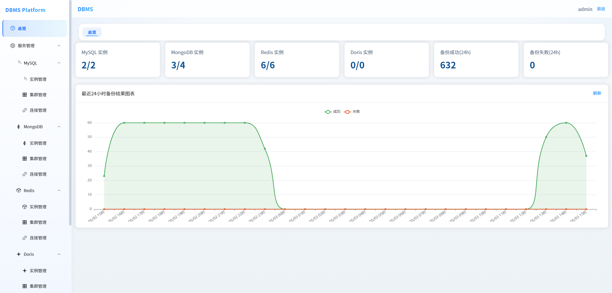
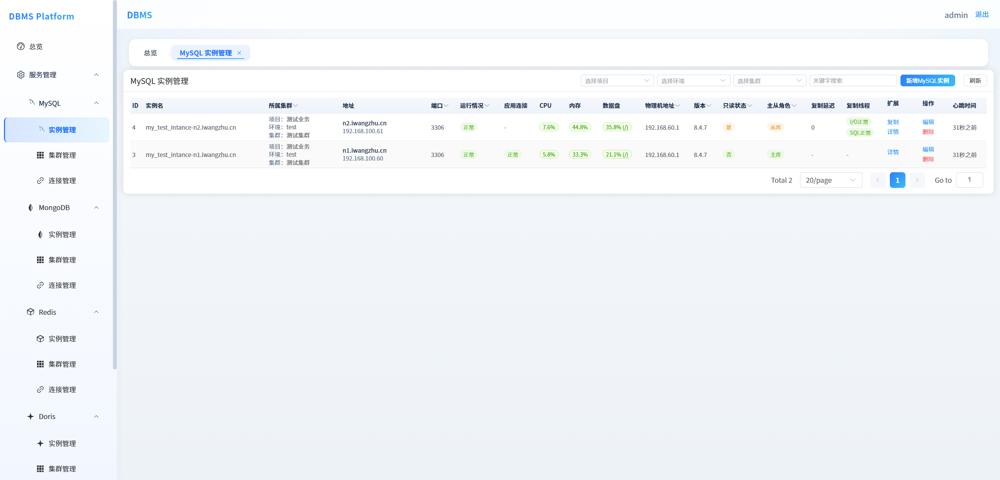
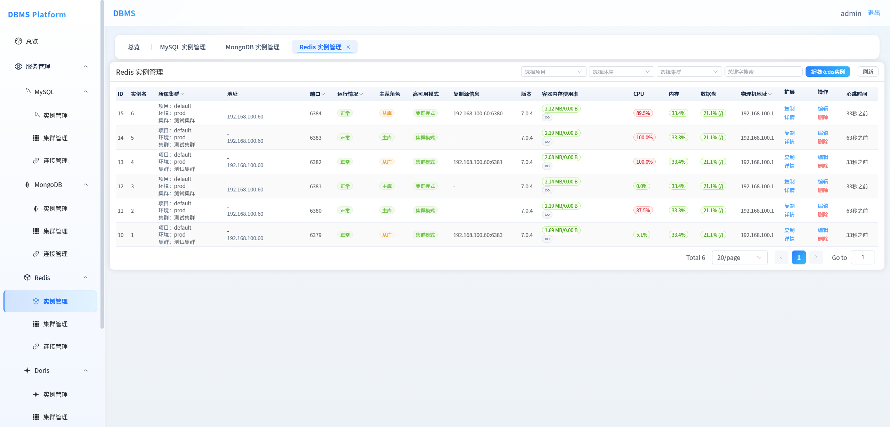
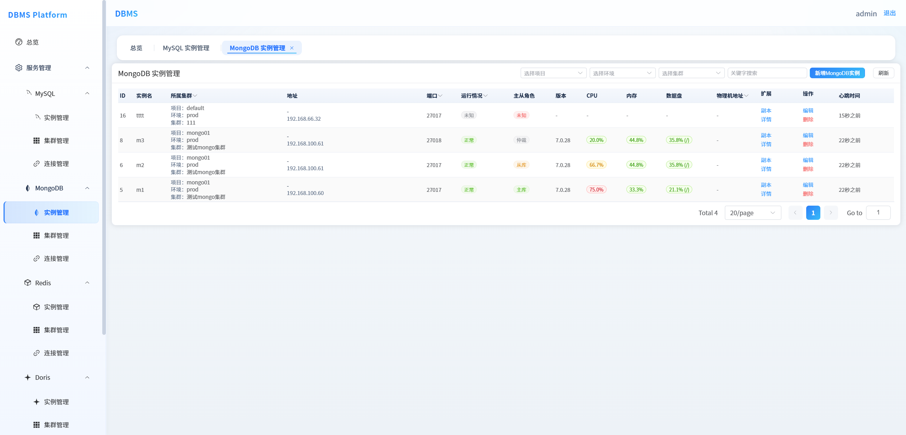
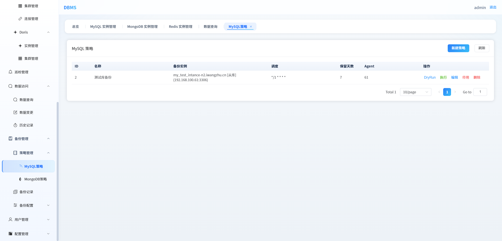
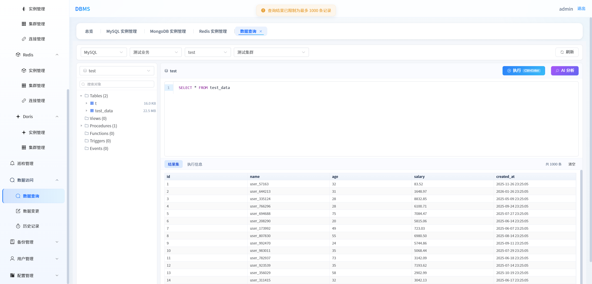
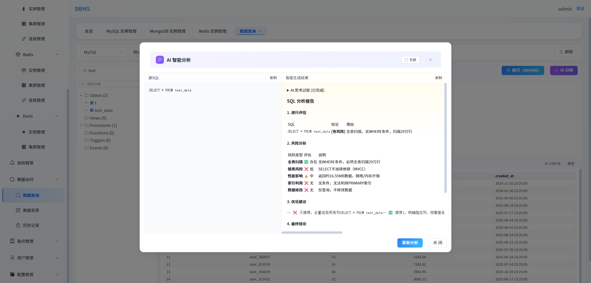
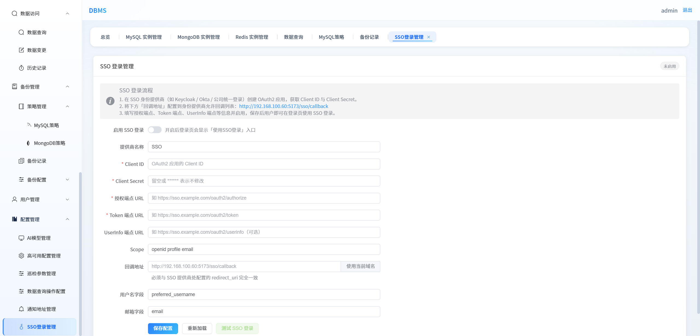

# DBMS 数据库统一管理平台

DBMS 是一个统一数据库管理平台，支持对 MySQL、Redis、Doris、MongoDB 等主流数据库进行集中化管理。通过本平台，运维人员可以高效完成数据库实例录入、状态监控、备份管理、权限控制等日常运维工作。

## 主要功能

### 数据库管理

- **多数据库支持**：同时支持 MySQL、Redis、Doris、MongoDB 的独立管理视图
- **实例与集群管理**：支持单实例与集群录入，地址支持 IP 或域名
- **域名解析刷新**：自动周期解析域名，发现 IP 变化时自动更新元数据

### MySQL 管理

- 主从拓扑展示：清晰呈现主从关系、IO/SQL 线程状态、复制延迟
- 连接状态监控：当前连接数、最大连接数、活跃连接数
- 实时会话管理：查看运行中的 SQL，支持 kill 会话
- 关键运行指标：Uptime、版本、QPS/TPS
- 只读状态监控
- 集群批量操作：配置变更与巡检

### MongoDB 管理

- 支持 mongod/mongos 单实例录入
- 副本集管理：成员角色、优先级、仲裁节点
- 状态监控：角色、健康状态、optimeDate、复制延迟、连接数

### Redis 管理

- 支持单节点、主从、Cluster 模式
- Cluster 自动拓扑发现
- 监控指标：节点角色、连接数、内存、命中率、key 数量、复制偏移

### 备份管理

- 备份策略配置：全量备份、增量备份（MySQL binlog）
- 工具选择、存储路径、保留周期、压缩设置
- 定时执行与手动立即执行
- 执行前检查：磁盘空间、实例可达性、工具可用性
- 日志记录：开始/结束时间、备份大小、执行结果
- 历史管理：筛选、下载、删除
- 支持 S3 远程存储上传
- 备份失败通知：支持企业微信、邮件通知

### 安全与权限

- **双重认证模式**：本地用户认证 / LDAP 认证（可配置切换）
- **SSO 单点登录**：支持 OAuth2/OIDC 标准协议
- **基于角色的权限控制**：管理员可管理全部资源，普通用户仅可查看授权实例
- **操作审计**：记录所有关键操作，支持审计日志查询
- **密码加密存储**：数据库连接信息使用 Fernet 加密

## 技术架构

### 技术栈

| 组件 | 技术选型 |
|------|----------|
| 后端 | Python 3.10+ / Flask RESTful API |
| 前端 | Vue 3 + Element Plus |
| 元数据存储 | MySQL 8.0+ |
| 定时任务 | APScheduler |
| 认证 | JWT + LDAP/SSO |

### 项目结构

```
DBMS/
├── backend/              # Flask 后端服务
│   ├── app/
│   │   ├── api/         # API 路由定义
│   │   ├── models/      # 数据模型
│   │   ├── services/    # 业务逻辑服务
│   │   └── tasks/       # 定时任务
│   ├── tests/           # 单元测试
│   └── requirements.txt  # Python 依赖
├── frontend/            # Vue 前端项目
│   ├── src/
│   │   ├── api/        # API 调用封装
│   │   ├── views/      # 页面组件
│   │   ├── components/ # 公共组件
│   │   └── router/     # 路由配置
│   └── package.json
├── dbms-agent/          # 备份代理服务（可选）
├── sql/                 # 数据库初始化脚本
├── docs/                # 架构设计、需求文档
└── README.md
```

## 快速启动

### 环境要求

- Python 3.10+
- Node.js 18+
- MySQL 8.0+
- CentOS 7+ / Ubuntu 18.04+ / Windows

### 1. 初始化元数据库

在 MySQL 中创建数据库并执行初始化脚本：

```bash
mysql -uroot -p -e "CREATE DATABASE dbms_meta CHARACTER SET utf8mb4 COLLATE utf8mb4_unicode_ci;"
mysql -uroot -p dbms_meta < sql/init.sql
```

### 2. 启动后端服务

```bash
cd backend

# 创建虚拟环境（Windows 使用 python -m venv .venv）
python -m venv .venv

# 激活虚拟环境
# Linux/macOS:
source .venv/bin/activate
# Windows:
.venv\Scripts\activate

# 安装依赖
pip install -r requirements.txt

# 复制并配置环境变量
cp .env.example .env
```

编辑 `.env` 文件，配置以下关键项：

```env
DATABASE_URL=mysql+pymysql://root:密码@localhost:3306/dbms_meta
SECRET_KEY=你的随机密钥
JWT_SECRET_KEY=你的JWT密钥
FERNET_KEY=生成方式: python -c "from cryptography.fernet import Fernet; print(Fernet.generate_key().decode())"
AUTH_MODE=local
```

启动服务：

```bash
python manage.py
```

后端服务默认运行在 http://localhost:5000

### 3. 启动前端服务

```bash
cd frontend

# 安装依赖
npm install

# 开发模式启动
npm run dev
```

前端默认运行在 http://localhost:5173

### 4. 访问系统

打开浏览器访问 http://localhost:5173

- 默认管理员账号：`admin`
- 默认管理员密码：`admin123`

> 首次启动会自动创建管理员账号，如需禁用请设置环境变量 `AUTO_BOOTSTRAP_ADMIN=false`

## 备份代理部署（可选）

对于需要远程执行备份的场景，可部署 dbms-agent：

```bash
cd dbms-agent
pip install -r requirements.txt
cp .env.example .env
python manage.py
```

## API 文档

启动后端服务后，访问 API 在线文档：

http://localhost:5000/api/v1/doc/api

## 系统截图

### 首页



### MySQL 实例管理



### Redis 实例管理



### MongoDB 实例管理



### 备份管理



### 数据查询



### AI 智能分析



### SSO 配置



## 安全建议

- 生产环境务必设置强密码的 `SECRET_KEY`、`JWT_SECRET_KEY` 和 `FERNET_KEY`
- LDAP 认证建议启用 LDAPS/TLS 加密
- 定期备份元数据库
- 限制备份目录的访问权限
- 建议通过 Nginx 反向代理启用 HTTPS