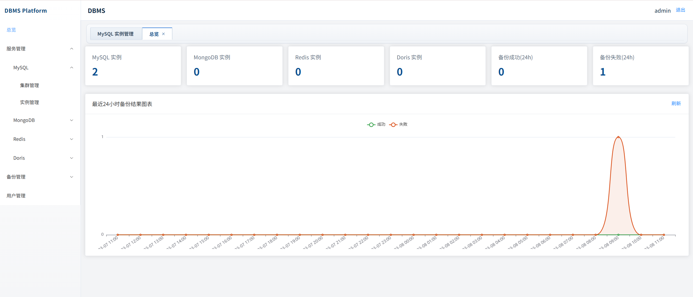
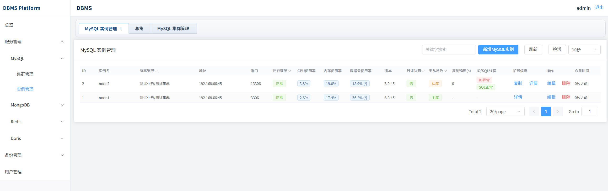

# DBMS Unified Management Platform

A unified database management platform for MySQL, Redis, Doris, and MongoDB.

## Tech Stack

- Backend: Python 3.10+, Flask (RESTful API)
- Frontend: Vue 3 + Element Plus (SFC)
- Metadata storage: MySQL 8.0+
- Scheduler: APScheduler / system cron compatible
- Deployment: Linux (CentOS 7+ / Ubuntu 18.04+)

## Key Capabilities

- Instance and cluster registration for MySQL/Redis/Doris/MongoDB
- Dedicated backend routes and frontend pages for MySQL/Redis/Doris/MongoDB
- Host input supports IP and domain, with scheduled DNS refresh
- Health and status monitoring, replication topology, and session inspection
- Backup policy management and manual/scheduled backup execution
- Backup overview metrics (success/failure), failure notifications, optional S3 offsite upload
- Dual auth mode: local users or LDAP
- Role-based permissions and audit logs

## Project Layout

```text
backend/                 Flask backend service
frontend/                Vue SFC frontend
docs/                    Requirement, architecture, API and deployment docs
sql/                     Metadata schema
```

## Quick Start

### 1) Backend

```bash
cd backend
python -m venv .venv
source .venv/bin/activate  # Linux/macOS
pip install -r requirements.txt
cp .env.example .env
python manage.py
```

### 2) Frontend

```bash
cd frontend
npm install
npm run dev
```

### 3) Initialize metadata DB

Run `sql/schema.sql` in your local MySQL metadata database.
If upgrading from an older schema, run `sql/migration_20260308_backup_extra.sql`.

## Notes

- Default auth mode is local user mode.
- First startup auto-creates local admin user (`admin` / `admin123`) unless disabled by env.
- In production, set strong `SECRET_KEY`, `JWT_SECRET_KEY`, and `FERNET_KEY`.
- LDAP integration points are scaffolded and can be wired to enterprise LDAP.




## api
http://$ip:5000/api/v1/doc/api